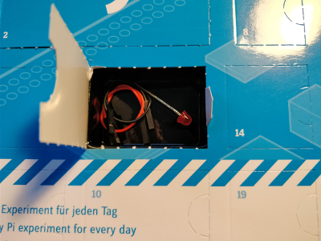
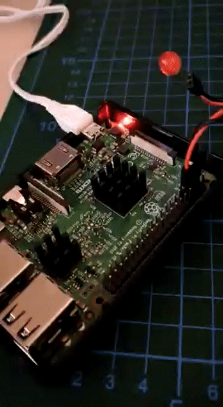

## Day 1
### Contents

Amount | Name | Note
-----| ---- | ----
1 | Red LED | with built-in resistor
2 | Jumper Wire | Black and red

### Task
First day was a simple circuit of one LED directly connected to the Raspberry PI, thanks to the built-in resistor.
The Python script toggles the LED at a rate of 1.0 Hz on and off.  

### Results
  
Script: [blinkenlight.py](blinkenlight.py)
