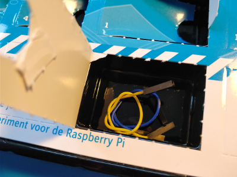
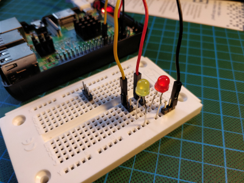
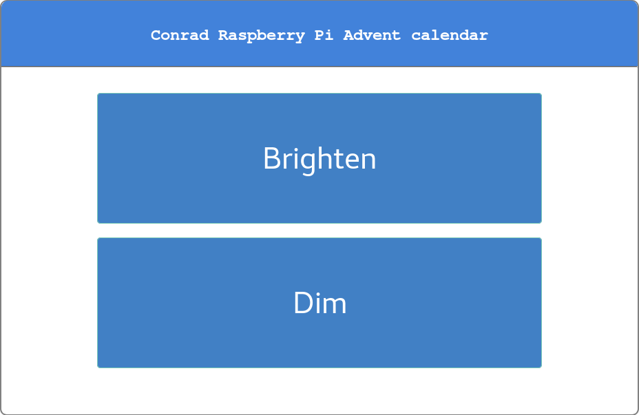

## Day 10

### Contents

Contens of Day 10

Amount | Name | Note
--- | --- | ---
2 | Jumper wire | Yellow and Blue

### Task
Implementing two simple scripts in Python to dim and brighten two LEDs via an web app.
One script starts with a dark LED and makes it brighter every 100 ms.
The other script starts with a switched on LED and dims it every 100 ms until its off.
Both scripts are engaged over a simple PHP web app running on an Apache2.

Circuit of Day 10

### Result

Web app

Files:
- [pwm_down.py](pwm_down.py)
- [pwm_up.py](pwm_up.py)
- [index.html](web_app/index.html)
- [index.php](web_app/index.php)
