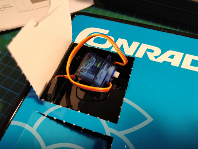

## Day 11

### Contents

Amount | Name | Note
--- | --- | ---
1 | Servo | -

### Task
Todays task was to hook up the servo motor and create a simple Scratch project which initializes the correct GPIO pin and acts on different keys.
The servo gets init at center. Left arrow key turns the servo about 90 degree to one side, up arrow key returns the servo back to center, and the right arrow key turns 90 degree to the oposite of the left arrow key. Hitting the space bar stops the servo at any point.

### Result

Scratch file: [servoController.sb](servoController.sb)
