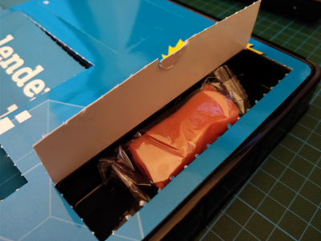
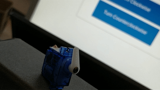

## Day 13

### Contents

Amount | Name | Note
--- | --- | ---
1 | Modeling clay | -

### Task
The goal of day 13 is to create two scripts which control the servo motor.
Unlike day 12, a web app is used to run those scripts.
One lets the lever rotate clockwise the other counterclockwise.

### Result

Files:
- [pwmServo_ccw.py](pwmServo_ccw.py)
- [pwmServo_cw.py](pwmServo_cw.py)
- [index.html](web_app/index.html)
- [index.php](web_app/index.php)
