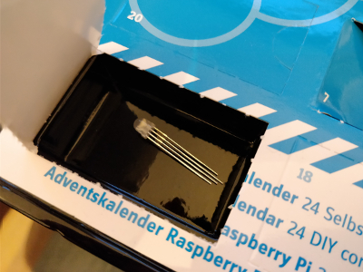
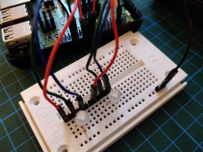

## Day 16

### Content of Day 16

Amount | Name | Note
--- | --- | ---
1 | RGB LED | w/ built-in resistor

### Task
The actual task was to build a simple *Scratch* program with sliders to manipulate the RGB LEDs.
Instead of *Scratch* I used the web framework *Flask* and simple *jQuery* sliders to change the values which are sent to the web server by *POST* requests.
To continuously adjust the duty cycle, the *PWM* driver must be run in a separate thread.

Circuit of day 16

### Result

Python script: [rgbLeds.py](rgbLeds.py)
Flask templates:
- [index.html](templates/index.html)
- [layout.html](templates/layout.html)
