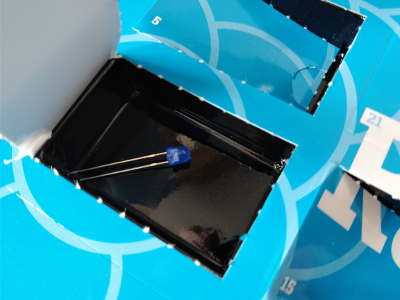
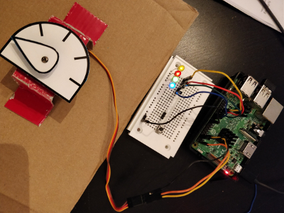

## Day 17

### Content of Day 17

Amount | Name | Note
--- | --- | ---
1 | Blue LED | w/ built-in resistor

### Task
Day 17 task uses the servo to visualize the position of an image on a *Scratch* stage.
Additionally four LEDs are used to indicate the position.

Circuit of day 17

### Result

Scratch file: [servoPosition.sb](servoPosition.sb)
