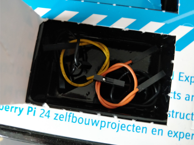
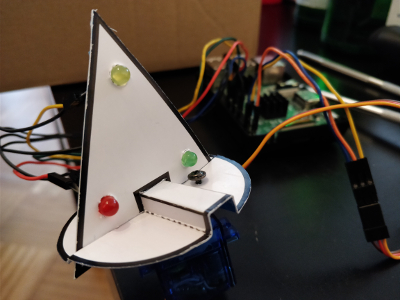
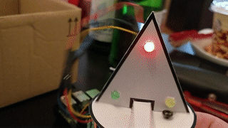

## Day 18

### Content of Day 18

Amount | Name | Note
--- | --- | ---
4 | Jumper Wire | Black, Yellow, Orange, and Blue

### Task
This day task was to create a *Scratch* program which lets the servo rotate 90 degree back and forth and turns on each LED at a time.
Instead of *Scratch* I used Python.

Circuit of day 18

### Result

Python script [xmasPyramid.py](xmasPyramid.py)
