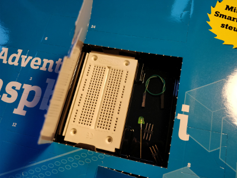
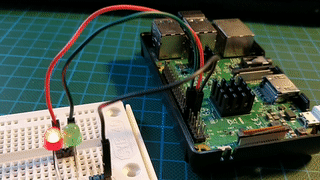

## Day 2
### Contents

Amount | Name | Note
---|---|---
1 | Breadboard | SYB-46 25x10
1 | Green LED | with built-in resistor
1 | Jumper Wire | Green
2 | Pin Headers | 3x1

### Task
Task of second day is to create a circuit with two LEDs on the breadboard and make them flash in turn at 1.0 Hz.  

### Result
  
Script: [blinkenlight.py](blinkenlights2.py)
