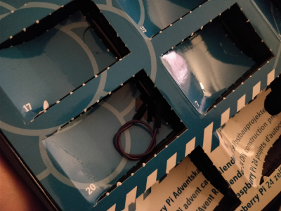
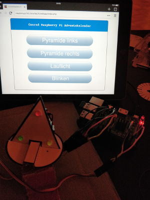

## Day 20

### Content of Day 20

Amount | Name | Note
--- | --- | ---
1 | Jumper Wire | Purple

### Task
Instead of a push-button like on day 19, the Christmas pyramid is controlled from an web app.
They won't run automatically at the same time.
Each function, turning to the left, turning to the right, activating running lights, or blinking lights, will be invoked separately.

Circuit of day 20

### Result

Files:
- [pyramidLedBlinking.py](pyramidLedBlinking.py)
- [pyramidLedRunning.py](pyramidLedRunning.py)
- [pyramidServoCCW.py](pyramidServoCCW.py)
- [pyramidServoCW.py](pyramidServoCW.py)
- [index.php](index.php)
- [index.html](index.html)
