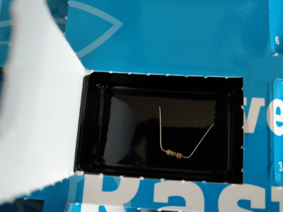

## Day 21

### Content of Day 21

Amount | Name | Note
--- | --- | ---
1 | Jumper Wire | Purple

### Task
This days task is to control the pyramid with two clay sensors.
One sensor lets all three LEDs blink at the same time, the other triggers running lights.

**TODO**

Circuit of day 21

### Result

**TODO**  
Python script: [xmasPyramidClay.py](xmasPyramidClay.py)
