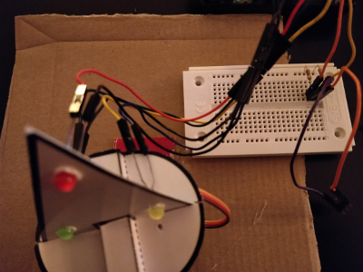
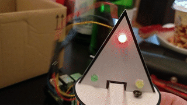

## Day 22

### Content of Day 22

Amount | Name | Note
--- | --- | ---
1 | Jumper Wire | Purple

### Task
The task for day 22 is to control the pyramid and LEDs with a clay sensor.
The pyramid only moves and the LEDs only blink when the clay sensor gets touched.

Circuit of day 22

### Result

Scratch file: [xmasPyramid.sb](xmasPyramid.sb)
