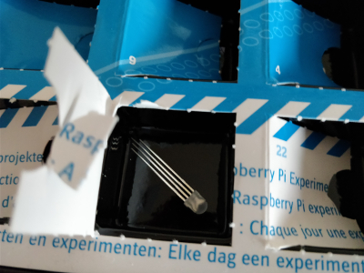

## Day 23

### Content of Day 23

Amount | Name | Note
--- | --- | ---
1 | Jumper Wire | Purple

### Task
On day 23 the RGB LEDs should glow in different colors which change automatically.
The colors are generated in the HSV color space and transformed with *colorsys.hsv_to_rgb*.

**TODO**

Circuit of day 23

### Result

**TODO**
Python script: [rgbLedsHsv.py](rgbLedsHsv.py)
