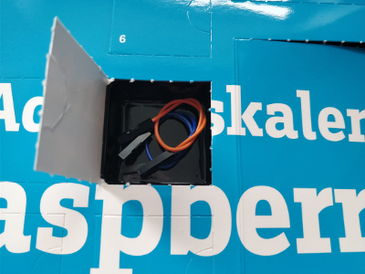

## Day 3
### Contents



Amount | Name | Note
---|---|---
2 | Jumper Wire | Blue and Orange

### Task
Third day task was sadly same as on day two but with a different package for the GPIOs and the flashing stops after ten iterations.  
To run this script successfully you need to install the correct GPIO package by executing  
```bash
sudo apt install rpi.gpio
```

### Result
  
Script: [flashingLights.py](flashingLights.py)
