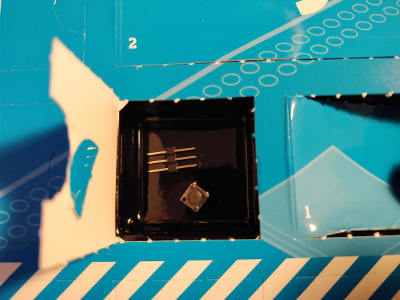
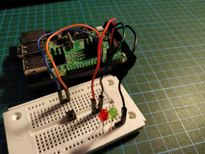

## Day 4

### Contents

Amount | Name | Note
---|---|---
1 | Button | -
1 | Pin Headers | 3x1

### Task
The task on day four is to add a pushbutton to the circuit from yesterday and modify the Python script to use it as an input.
On pressing the button one LED turns off the other turns on.

### Result

*TODO*

Script: [buttonLights.py](buttonLights.py)
