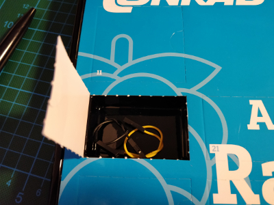
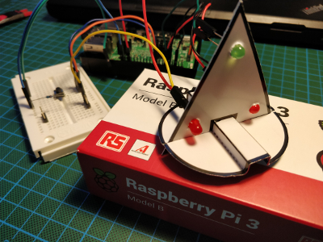
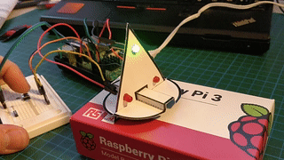

## Day 5

### Contents

Amount | Name | Note
---|---|---
2 | Jumper Wire | Black and Yellow

### Task
First I had to cut the paper Christmas tree out and put it together.
So far there were only two LEDs but the stencil had three holes for LEDs.
To assemble the tree fully I used another red LED with a 330 Ω current-limiting resistor.
The Python script from yesterday changed slightly.
It toggles the LEDs only when the input is high, viz. the button is pressed, and I obviously had to add an extra output for the third LED.

Circuit of Day 5

### Result

Result of Day 5

Script: [ledTree.py](ledTree.py)
