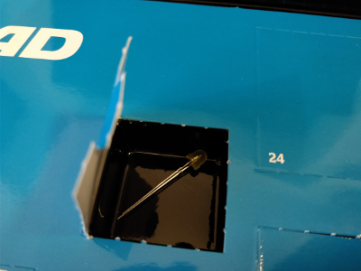
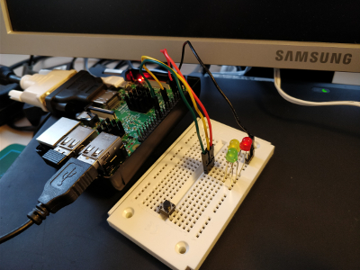

## Day 6

### Contents

Amount | Name | Note
---|---|---
1 | LED | Yellow with built-in resistor

### Task
** TODO **

Circuit of Day 6

### Result

Result of Day 6

Scratch file: [colorSensingDog.sb](colorSensingDog.sb)
