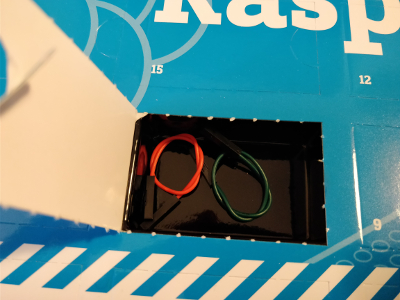
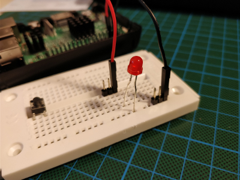

## Day 7

### Contents

Amount | Name | Note
--- | --- | ---
2 | Jumper Wire | Green and Red

### Task
The task for day 7 is to create a web app which can execute a simple Python script to switch on a LED.

**TODO**

Circuit of Day 7

### Result

**TODO**
