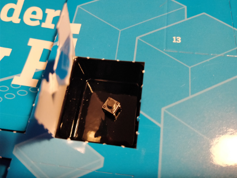
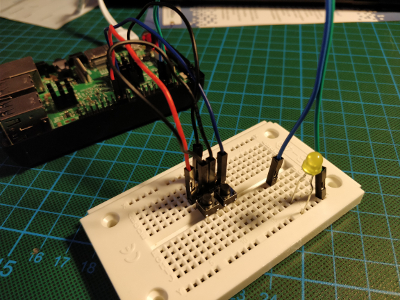

## Day 8

### Contents

Amount | Name | Note
--- | --- | ---
1 | Push-button | -

### Task
Create a program with Scratch which dims and brightens a LED with buttons.
The circuit consisted of two push-buttons and a yellow LED.
One button dims the LED, the other brightens it.

Circuit of Day 8

### Result

Result of Day 8

Scratch file: [pwmLed.sb](pwmLed.sb)
