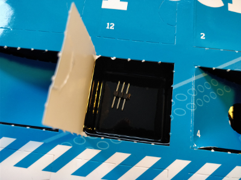
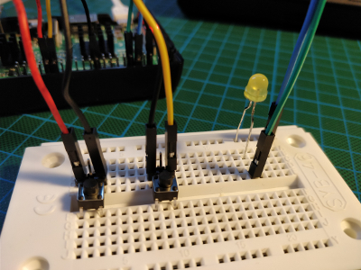

## Day 9

### Contents

Amount | Name | Note
--- | --- | ---
1 | Pin Header | 3x1

### Task
The same task as on day 8 but implemented in Python.  
See [Day 8](../day8/README.md#Task)

Circuit of Day 9

### Result

Result of Day 9

Python script: [dimLed.py](dimLed.py)
